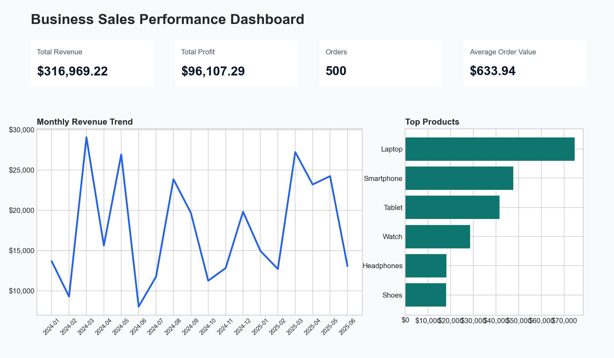

# Business Sales Performance Analytics

Future Interns Data Science & Analytics Task 1 submission focused on cleaning sales data, analyzing revenue and profit performance, and presenting the results through a client-ready interactive dashboard.



## Project Highlights

- Clean sales dataset in CSV and XLSX formats
- KPI dashboard with Total Revenue, Total Profit, Orders, Average Order Value, and Profit Margin
- Interactive filters for Region, Category, Product, and Date
- Monthly revenue trend analysis
- Revenue by product, category, and region
- Profit by category
- Executive business insights and actionable recommendations
- GitHub-ready preview images for quick portfolio review

## Key Results

- Total Revenue: $316,969.22
- Total Profit: $96,107.29
- Orders: 500
- Average Order Value: $633.94
- Profit Margin: 30.3%

## Business Insights

Electronics is the highest-value category and should remain the primary investment area for inventory and campaign planning. East is the strongest region by revenue, making it a strong candidate for expansion and retention campaigns. Laptop is the leading product, so stock availability and product-led promotions should be prioritized around it.

Home & Kitchen contributes less revenue than the strongest categories, so targeted promotions, bundles, and pricing tests can help improve its contribution without weakening overall profitability.

## Repository Structure

```text
sales_analysis/
|-- data/
|   |-- sales_data.csv
|   `-- sales_data.xlsx
|-- dashboard/
|   |-- sales_dashboard.html
|   `-- streamlit_app.py
|-- outputs/
|   |-- revenue_trend.png
|   |-- product_analysis.png
|   |-- category_analysis.png
|   |-- region_analysis.png
|   `-- dashboard_screenshot.png
|-- analyze_sales.py
|-- requirements.txt
|-- sales_dashboard.html
|-- sales_summary.txt
|-- sales_data.csv
`-- sales_data.xlsx
```

The top-level CSV, XLSX, and HTML files are kept for simple access. The organized `data/`, `dashboard/`, and `outputs/` folders provide the polished submission structure.

## How To Run

Create or refresh the dataset, reports, dashboard HTML, and chart images:

```bash
python analyze_sales.py
```

Run the interactive Streamlit dashboard:

```bash
streamlit run dashboard/streamlit_app.py
```

Open the standalone HTML dashboard:

```text
dashboard/sales_dashboard.html
```

## Dashboard Features

- KPI cards update based on selected filters
- Monthly revenue trend responds to the selected date range
- Product, category, and region charts update interactively
- Category chart compares revenue and profit
- Filtered order detail table shows the highest-value records

## Recommendations

- Protect inventory for the highest-revenue products, especially Laptop, Smartphone, and Tablet.
- Prioritize East and South regional campaigns because they hold the strongest revenue base.
- Use Electronics-led bundles to lift average order value.
- Run targeted promotions for Home & Kitchen to improve category contribution.
